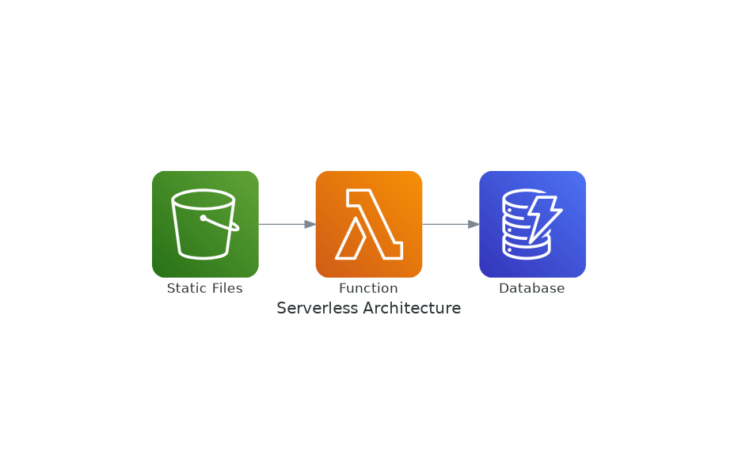
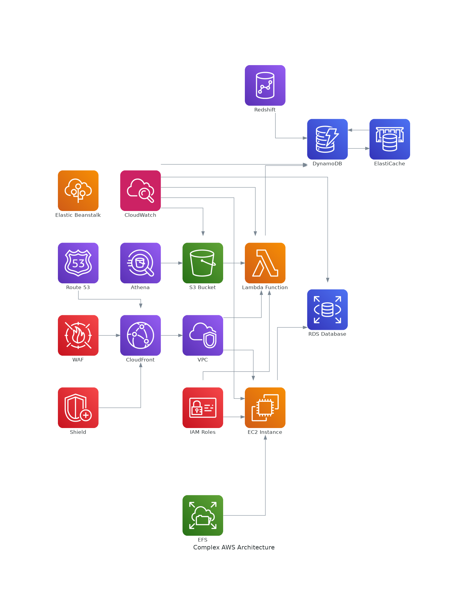

# Serverless Architecture with AWS Diagrams

Welcome to the **Serverless Architecture with AWS Diagrams** project! This repository demonstrates how to create beautiful, intuitive AWS architecture diagrams using Python and the **Diagrams** library. You can visualize various AWS services and their interactions in a serverless environment.

---

## 🚀 Getting Started

Follow the instructions below to set up your environment and generate diagrams for your serverless AWS architecture.

### 1. Clone the Repository

Clone the repository to your local machine:
```bash
git clone https://github.com/Deepak17460/Aws-Diagrams.git
cd Aws-Diagrams
```
```bash
git clone https://github.com/mingrammer/diagrams.git
cd diagrams
```

### 2. Run the Setup Script

Ensure that Python 3 and pip are installed. Then, run the provided setup script to create and activate a virtual environment, install the required dependencies, and set up system dependencies:

```bash
./run_script.sh
```

This script will handle the creation of the virtual environment, installation of Python packages, and installation of additional system dependencies for rendering diagrams and viewing images.

---

## 🛠️ How to Create a Diagram

Once your environment is set up, you can start creating diagrams to visualize AWS services and their interactions. Here's a basic script to generate a simple serverless architecture diagram:

```python
from diagrams import Diagram
from diagrams.aws.compute import Lambda
from diagrams.aws.storage import S3
from diagrams.aws.database import Dynamodb

with Diagram("Serverless Architecture", show=False):
    S3("Static Files") >> Lambda("Function") >> Dynamodb("Database")
```

To generate the diagram, run the script:

```bash
python3 create_diagram.py
```

The script will create an image file representing your architecture.

---

## 📦 About the Diagrams Library

The **Diagrams** library, developed by [mingrammer](https://github.com/mingrammer/diagrams), allows you to create cloud architecture diagrams programmatically. It supports a wide range of cloud providers, including AWS, Azure, and GCP.

For more information and examples, visit the [Diagrams GitHub Repository](https://github.com/mingrammer/diagrams).

---

## 🔧 Technologies Used
### 📷 Example Diagrams

Here are some example diagrams generated using the **Diagrams** library:

#### Simple Serverless Architecture


#### Complex AWS Architecture

- **Python 3**: Used for writing the diagram generation script.
- **Diagrams Library**: A Python library for creating visually appealing cloud architecture diagrams.
- **AWS Services**: Visualize services such as Lambda, S3, and DynamoDB in your serverless architecture.

---

## 🤝 Contributing

We welcome contributions to improve and expand the project. Feel free to open issues or create pull requests. Please make sure your code follows the coding standards and includes proper documentation.

---

## 📄 License

This project is licensed under the MIT License. See the [LICENSE](LICENSE) file for more details.

---

## 🌐 Connect With Us

- [GitHub](https://github.com/mingrammer/diagrams)
- [Twitter](https://twitter.com/diagrams)

---
